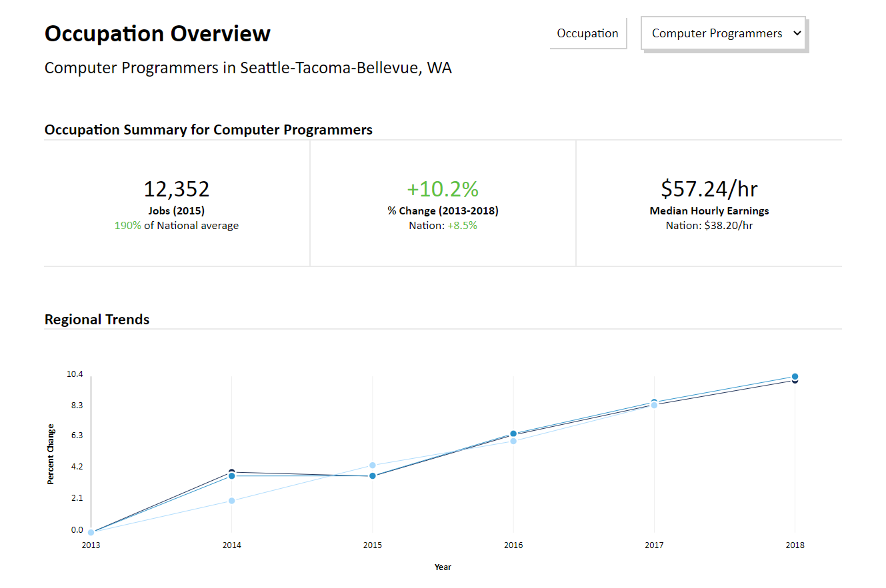
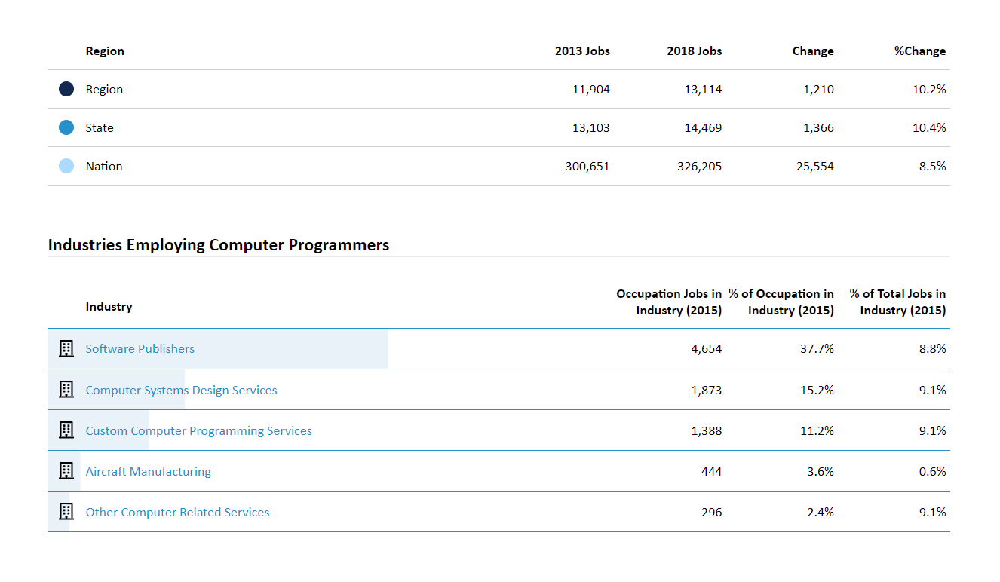

This project was bootstrapped with [Create React App](https://github.com/facebook/create-react-app).

# Emsi Interview Project

## Local Installation

Clone the repository to your computer, then in its root directory run `npm install` and then `npm start`.

It should start running in development mode with hot reloading on localhost:3000

## Attributions

Building icon svg downloaded from [FontAwesome](https://fontawesome.com/license)
